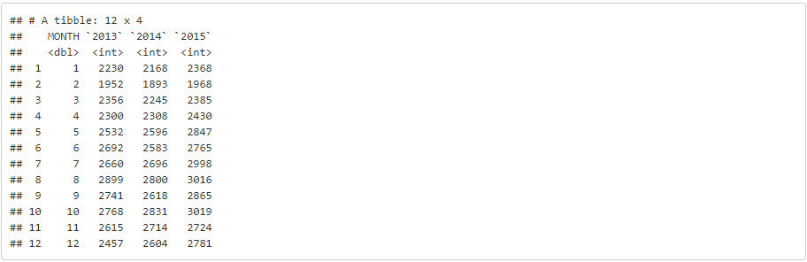
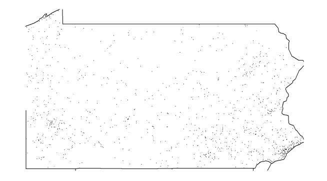

```{r, include = FALSE}
knitr::opts_chunk$set(
  collapse = TRUE,
  comment = "#>"
)
```


The series of functions in the farspackage allow you to access data from Fatality Analysis Reporting System, summarize it by year, and plot the data on the data on a map of the indicated US state.  Although there are five functions in this package, you only need to use the `fars_summarize_years()` function or the `fars_map_state()` function.  These utilize the other remaining functions in the package which create cover the processes needed to access specific years from the downloaded FARS data for **accident data**.

Data from the FARS database must already be downloaded and placed in the project workspace.

The `fars_summarize_years` function requires only the specification of which years you would like to summarize.  The supporting functions will access that data, and this function will then summarize it into a clean data table.


`fars_summarize_years(c(2013,2014,2015))`



The `fars_map_state` function requirs a specific year and a state code to product a map of the state with points indicating the location of accidents for that year.

`fars_map_state(42,2013)`

